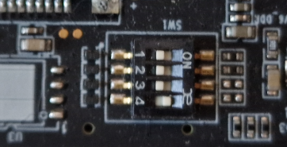
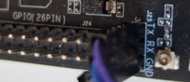

# Building Your Own Yocto Image for Banana Pi F3 #

This document will go through the work done to add initial Yocto support for the RISC-V based development board Banana Pi F3. The work was based on a buildroot configuration for the same board and there are several things that can be improved on in the future. More on that at the end of this document.

But first, let's familiarize ourself a bit with the Banana Pi F3 development board.

## What is Banana Pi F3? ##

Banana Pi F3 is a development board sold by [youyeetoo](https://www.youyeetoo.com/), with an 8 core RISC-V chip from [SpacemiT](https://www.spacemit.com/en/), called Key Stone K1.

The most exciting feature of this development board is that the K1 chip has hardware support for the RISC-V Vector specification 1.0. For the longest time, the Vector specification was stuck on version 0.7 and never got a ratified state. But now that the specification has been ratified, silicon implementing the specification is slowly starting to pop up on the market.

There are today a few proper development boards available today for consumers to get their hands on. And Banana Pi F3 is one of the most popular.

The board itself have the usual features needed for developers to experiment and develop on it. Ethernet, WiFi, Bluetooth 4.2, USB 3.0, HDMI, SD card slot, USB-C, GPIO pins, UART pins, PCIe, and the list goes on.

Overall, it is a very nice development board for those who wishes to explore the RISC-V architecture and experiement with the RISC-V vector 1.0 implementation.

## Why Yocto support? ##

In short:

  * Yocto is an industry standard within the embedded systems industry.
  * Bianbu Linux is built using buildroot
  * Bianbu Linux have a few limitations related to open source and documentation

The first point needs no further explanation. So let's dive into the second and third points.

### Bianbu Linux BSP is built using buildroot ###

The [Getting Started Guide](https://docs.banana-pi.org/en/BPI-F3/GettingStarted_BPI-F3) recommends you to download and use pre-built images based on [Bianbu Linux](https://bianbu-linux.spacemit.com/en/). Bianbu Linux is a BSP for the SpacemiT chips, including the Key Stone K1 on Banana Pi F3. The Bianbu Linux BSP is built using buildroot, with forks of a number of git repos, along with a few patches, and one proprietary file needed to make the board boot.

Buildroot in itself is not a bad buildsystem of course. It's just not the standard in the embedded industry today. That's why we thought it was worth to create a Yocto layer for the Banana Pi F3 board.

### Bianbu Linux BSP limitations ###

The recommended Bianbu Linux BSP is mostly open source and are fairly well documented for the basic operations. However, there are aspects of it that burdens a developer in certain areas.

#### Open source aspects ####

One negative aspect (as of this writing) is that there's a few software components that are not fully open sourced yet, namely these:

  * RCPU (Real-Time CPU) firmware, esos.elf.
  * Support for the Imagination PowerVR GPU.
  * Support for video hardware acceleration

These components are distributed as binary blobs. The esos.elf binary blob is required in order to boot the board, while the others are only needed if you need to fully utilize the GPU and hardware accelerated video encoding and decoding.

This is mentioned in the [FAQ](https://bianbu-linux.spacemit.com/en/faqs) which is a plus of course. But it is an aspect you have to take into consideration if you plan to use the GPU's full power and/or hardware acceleration for video.

#### Documentation ####

Another limitation, certainly not as severe as the open source limits mentioned above, is the documentation of the board. Not to say that there's enough documentation in english. There are. Enough at least to build a working distribution according to their instructions. But many parts of the [Development Guide](https://bianbu-linux.spacemit.com/en/development_guide) are still not translated to english. We hope this is still being worked on.

## The meta-bananapi-f3 layer ##

The meta-bananapi-f3 layer aims to provide support for the Banana Pi F3 development board. The current version is very basic but provides the recipes and configurations needed to create an SD card image that will boot the board and give you access to a Linux terminal via UART, an IPv4 address via DHCP, and an SSH server.

The following recipce directories are used in this layer:

  * recipes-bsp - recipes for OpenSBI and U-Boot
  * recipes-core - recipe for SD card image creation
  * recipes-kernel - recipe for the Linux kernel
  * recipes-devtools - recipes related to genimage

### recipes-bsp ###

There are two recipes in this directory. OpenSBI, and U-Boot. Both recipes configure and build OpenSBI and U-Boot using specific forks and branches.

The U-Boot recipe configures and builds a specific fork of U-Boot v2022.10. In similar fashion, the OpenSBI recipe configures and builds a specific fork of OpenSBI v1.3.

### recipes-core ###

This directory contains a single recipe to create the SD card image. In future versions of the layer, this will be replaced by a wic recipe.

### recipes-kernel ###

The kernel used for the Banana Pi F3 board is based on the 6.1.15 kernel and uses a specific fork for the k1 chip. Future versions of the layer will hopefully use mainline kernel when support for the k1 chip is merged to mainline Linux.

### recipes-devtools ###

Since the layer uses genimage to create the SD card image, we need to add the genimage recipe. The confuse recipe is needed by genimage itself. Both of these recipes will be removed in future versions of the layer when genimage is replaced with wic.

## Build a bootable SD card image using Yocto ##

Regardless the limitations of the Banana Pi F3 development board, it is still a very good board to experiment with the RISC-V vector support and build our own Yocto based distribution. So let's do just that.

## Host Requirements ##

Depending on which Linux distribution you are running, you may need to manually install some host dependencies. It is recommended to use one of the supported Linux distributions though.

See the [the list of supported Linux distributions](https://docs.yoctoproject.org/5.0.4/ref-manual/system-requirements.html#supported-linux-distributions)

It might also be a good idea to take a look at the [System Requirements](https://docs.yoctoproject.org/5.0.4/ref-manual/system-requirements.html#system-requirements).

## Prerequisites ##

Prepare the build by creating a project directory and fetch Poky from the Yocto project. The `scarthgap` release of Poky is used.

```shell
mkdir bpi-f3-yocto
cd bpi-f3-yocto
git clone git://git.yoctoproject.org/poky -b scarthgap
```

We also need to get the `meta-riscv` layer which our layer depends on:

```shell
git clone https://github.com/riscv/meta-riscv.git -b scarthgap
```

## Project setup and configuration ##

The first thing we need to do is to clone the `meta-bananapi-f3` layer.

```shell
git clone https://github.com/qamcom/Banana-Pi-F3-for-Yocto.git meta-bananapi-f3

```

Next, we initialize a build directory:

```shell
source poky/oe-init-build-env build
```

This places you in the build directory with some pre populated files.

Two files are of interest to us:
  * `conf/bblayers.conf`
  * `conf/local.conf`

Add the following lines to the `BBLAYERS` variable in `conf/bblayers.conf`:
```
  /path/to/bpi-f3-yocto/meta-riscv \
  /path/to/bpi-f3-yocto/meta-bananapi-f3 \
```

Next, change the `MACHINE` variable in `conf/local.conf`.

Find the line where the default `MACHINE` is set to `qemux86-64` (should be at line 39), and change it to this:

```shell
MACHINE ??= "bananapi-f3"
```

## Build and prepare SD card ##

All that's left to do now, is to start the build. This will take quite a while. On a Ryzen 7 16 cores 2.7GHz, 32GB RAM, NVMe disk, this took ~40 minutes but can take much longer of course.

```shell
bitbake bananapi-f3-image
```

When the build has finished successfully, there will be an image file in `<build>/tmp/deploy/images/bananapi-f3/` named `sdcard.img`.

This image file can be written to an SD card with dd, like so:

```shell
sudo dd status=progress oflag=sync bs=1M if=tmp/deploy/images/bananapi-f3/sdcard.img of=/dev/sd<X> ; sync
```

**WARNING** Please make sure you write the image to the correct device (/dev/sd<X>)!

## Setup the board ##

First, ensure that the board is configured to boot from an SD card by setting the DIP switches correctly. All switches except switch 4 should be OFF. (See image below)



Next, connect a serial-to-USB dongle to the UART pins next to the GPIO pins (see image below).



Start your favorite terminal program and connect to the UART device.

And don't forget to insert the SD card into the SD card slot too.

Now you're ready to power on the board. After a short moment, you should be presented with a login prompt. Login as root with no password.

**WARNING:** Obviously, make sure the board is only accessible from your internal network, since a root account with no password is the ultimate security flaw.

And with this we have a ready-to-use development environment for RISC-V with vector extensions built from an industry standard Linux distribution. As a next step we hope to dig deeper into what you can do with this.